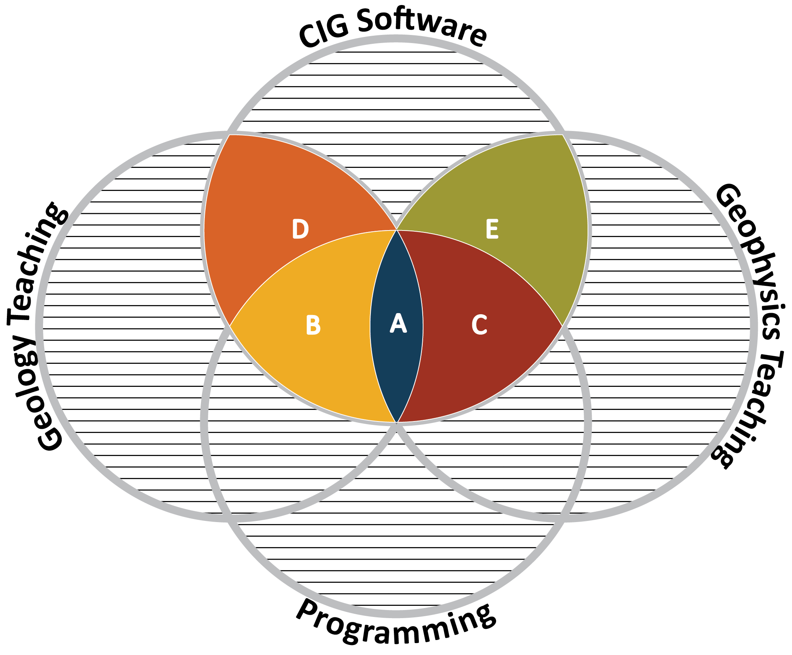
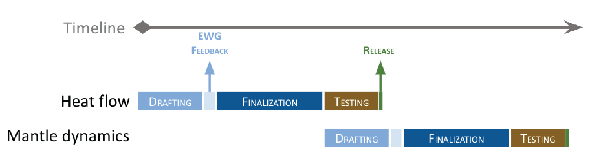

| Geodynamics Education Modules |  |  |
|:--------|-------:|:--------|
|         |        |  |

## About
Geodynamics is a field of Earth Sciences that relies heavily on computational methods and modeling tools to advance our understanding of Earth systems. The integration of field and geophysical observations with numerical modeling is nowadays essential in geodynamical research. Thus, the need to incorporate computational skills into undergraduate and graduate curricula is crucial. Individual efforts already exist, as many lecturers that use computational tools in their research tend to integrate some degree of computation in their syllabus. However,  there are many barriers to making this a widespread practice. Some lecturers do not have the appropriate expertise in computational methods, or if they do, then the added workload to redesign or adjust courses accordingly can be dissuasive. In addition, the installation of these computational tools can be a challenge for students (e.g., due to the large number of underlying libraries and dependencies) and a barrier to their use in a classroom environment. 
Hence, developing teaching material that is openly available and easily deployable should help instructors fill the gap between existing curricula and skills needed to leverage the great potential of (CIG) computational tools.

## Objective
The aim of this initiative is to develop modular teaching resources for upper division and graduate level geodynamic courses. By integrating computing methods and tools in a Jupyter Notebook environment to teach geodynamical concepts, these resources should enable and promote the training of a computationally skilled workforce and increase awareness and recruitment  of students to the Earth Sciences disciplines and specifically computational geodynamics.

Due to their modular design, these resources could be used independently, but could also be easily combined to create new (or more advanced) teaching material and tutorials for CIG software workshops.

## Philosophy
This initiative is led by the Computational Infrastructure for Geodynamics and is overseen by an Education Working Group [(EWG)](#education-working-group). The latter recognized the existing overlap between the teaching of geodynamics, programming, and CIG software. The teaching component can be divided into two paths, the geology path, and the geophysics path. The geology path focuses on the qualitative (or semiquantitative) understanding of the physical processes of the Earth and terrestrial planets. The students are introduced to the governing physics equations, but are not expected to solve them. The geophysics path refers to programs that require a strong background in physics and teach geodynamical concepts in a quantitative way with an emphasis on manipulating and solving the governing equations. This is summarized in Figure 1, where the highlighted five domains (A, B, C, D, E) are where we think CIG can contribute by using the CIG software to support the teaching of geodynamical concepts and the related computational methods. While A, B, and C can be seen as representing upper division courses of increasing complexity, respectively, D and E are research intensive programs at graduate and postgraduate level.

|  |
|:---:|
|Figure 1: Overlap between geodynamics teaching, programming and CIG software. A: foundational level. B: intermediate to advanced level in geology programs. C: intermediate to advanced level in geophysics programs. D: research in geology. E: research in geophysics.|

## Geodynamics’ topics
The educational resources will address key topics in geodynamics. Our core focus will be on the following concepts:

| Topics | Subtopics |
|:-------|:----------|
| 101 modeling | Based on van [Zelst et al. (2022)](https://doi.org/10.5194/se-13-583-2022): <ul><li> Physical model </li><li> Numerical model </li><li> Code verification </li><li> Model setup </li><li> Model validation </li><li> Model analysis </li><li> Communicating modeling results </li><li> Software, data, and resource management </li></ul>|
| Heat flow | <ul><li> Radiogenic heat/crustal composition </li><li> Mantle temperature </li><li> Surface heat flow in the oceans (halfspace cooling, plate model) </li></ul> |
| Mantle dynamics | <ul><li> Global mantle flow </li><li> Plate driving forces </li><li> Earth chemical evolution </li><li> Non-dimensional numbers, e.g., Rayleigh number, Nusselt number, scaling for simple convection </li><li> Different tectonic regimes (mobile lid, stagnant lid, heat piping, etc) / regime diagrams </li><li> Mantle plumes </li></ul> |
| Elasticity & flexure | <ul><li> Loading-Induced Deformation </li><li> Elastic Rebound Theory </li></ul> |
| Stress & strain | <ul><li> An introduction to tensors </li><li> Measuring stress and strain </li><li> Simple stress-strain relationships </li><li> Time scales and links to earthquake seismology </li></ul> |
| Rheology | <ul><li> Viscous Flow </li><li> Brittle Failure </li><li> Elasticity </li><li> Composite rheologies </li></ul> |
| Phase transition | <ul><li> Clapeyron slopes / exothermic vs. endothermic Melt </li></ul> |
| Melt | <ul><li> generation & partitioning </li><li> Extrusive vs intrusive </li><li> Outgassing of volatiles and coupling with atmospheric studies </li></ul> |
| Extension, rifting, & drifting | <ul><li> Continental rifts </li><li> Mid-oceanic ridges  </li><li> Initial heterogeneities (what are they? initial & boundary conditions and their effects) </li></ul> |
| Shortening, orogenesis, & subduction |  <ul><li> Upper plate deformation (mountains vs. back-arcs) </li><li> Subduction zone forces (e.g., slab pull, ridge push) </li><li> Subduction-induced mantle flow (e.g., toroidal vs poloidal) </li><li> Thermal structure and relation to other topics (earthquake locations, tomography etc) </li></ul> |

## Prerequisites
Each topic is covered in a series of notebooks of varying levels taking into consideration the course level and the student proficiency in terms of computing literacy. The levels of complexity could be a function of the domain science covered by the notebooks or a function of the computational skills required to efficiently use the notebooks. In our case, these levels are defined below based on the latter.

- Foundational resources target introductory geodynamic courses and require minimal programming skills. The analytical section of the notebooks will include all necessary scripts and functions discretizing the governing equations of the targeted geodynamic concept. The geodynamic section of the notebook will include the required inputs (e.g., input parameters, input files) to simulate the geodynamic concept using CIG software.

- Intermediate resources teach students simple programming and computational skills. For instance, a discretization of the governing equations could be provided, and students would be prompted to rewrite them using different libraries or a different analytical approach. In terms of geodynamic modeling, students will learn how to adapt and modify CIG software parameter files and analyze (post-process) modeling outputs.

- Advanced resources require a level of programming and computational literacy, which students can build on to acquire new advanced skills. For instance, they will be prompted to discretize the governing equations by writing their own scripts and functions. They will also learn how to derive input parameters and compile input files to run geodynamic models using CIG software.

## Notebook template
The typical notebook should include:
1. Summary section, to introduce the geodynamic topic and the governing physics equations.

2. Analytical section, where the governing equations of the geodynamic concept are solved/modeled  analytically. This would allow the student to acquire and apply pythonic skills.

3. Numerical  section, where the geodynamic topic is addressed numerically using CIG software. This would allow the student to acquire and apply computational modeling skills.
The level of complexity of each of these sections should be consistent with the intended level of the notebook (i.e., foundational, intermediate, or advanced).

|  |
|:---:|
|Figure 2: Notebook template.|

## Development strategy

|  |
|:---:|
|Figure 3: Notebook development strategy.|

The development of these notebooks will consist of three distinct steps:
1. **Drafting:** an outline of the notebook will be made capturing the content of each of the above-mentioned sections. The draft will be shared with EWG for feedback.

2. **Finalization:** the notebook will be finalized based on the feedback provided by the EWG. 

3. **Testing:** the finalized notebook will be uploaded on HubZero and access will be given to the EWG to test it. Once the EWG is happy with the notebook, it can be released.

The development timeline will be topic-dependent and should be assessed on a case-by-case basis. For instance, the heat flow notebook (foundation level) took ca. 10 weeks to develop:

- Drafting: 1 week.
- EWG feedback: 4 weeks (this could be reduced down to 1-2 weeks and will depend on the EWG availability and engagement).
- Finalization: 2 weeks.
- Testing: 3 weeks (like the initial feedback phase, this will depend on the EWG availability and engagement).

## Education Working Group
The Education Working Group (EWG) works to promote access to educational materials for geodynamics. The EWG advances the infrastructure and content needed to develop a computationally skilled workforce and increase discovery of the discipline. This is achieved through integrating computation with domain science in upper division and graduate level learning.

**Committee members:**
- Juliane Dannberg (University of Florida)
- Mohamed Gouiza (University of California, Davis)
- Adam Holt (University of Miami)
- Lorraine Hwang (University of California, Davis)
- Gabriele Morra (University of Louisiana at Lafayette)
- John Naliboff (New Mexico Tech)
- Max Rudolph (University of California, Davis)
- Sarah Stamps (Virginia Tech)
- Iris van Zelst (German Aerospace Center, DLR)
